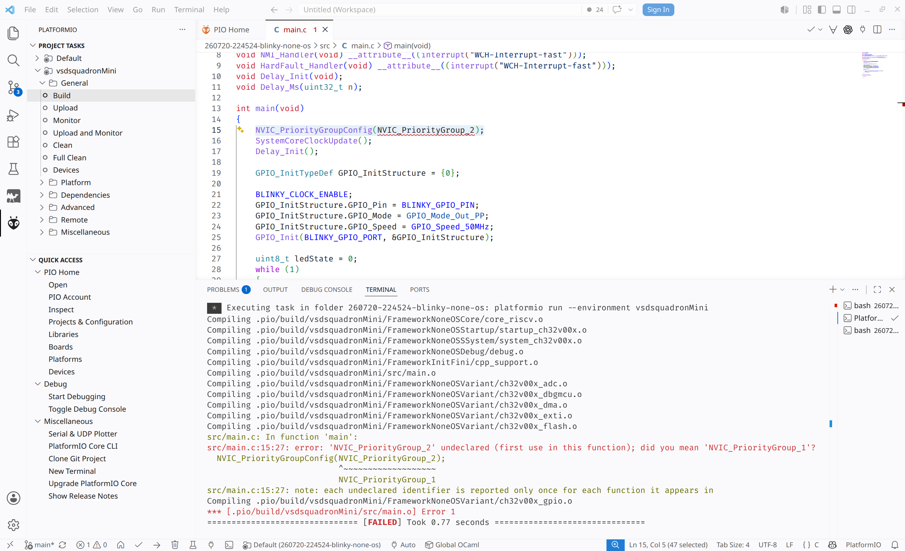
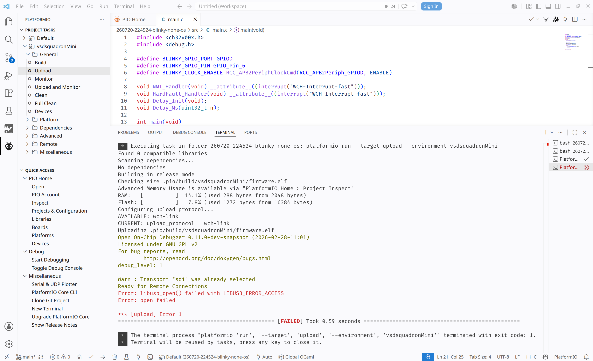
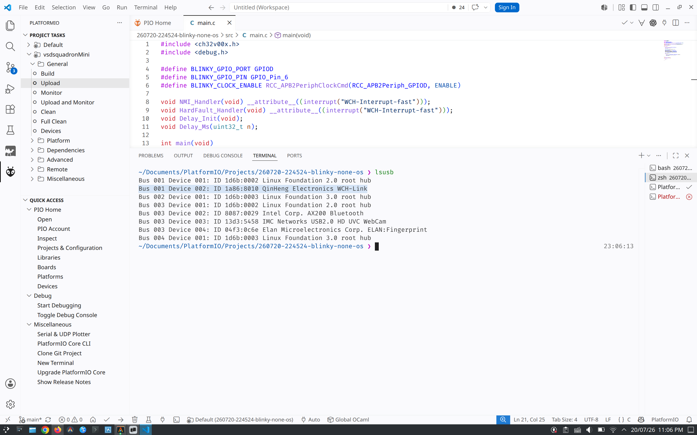
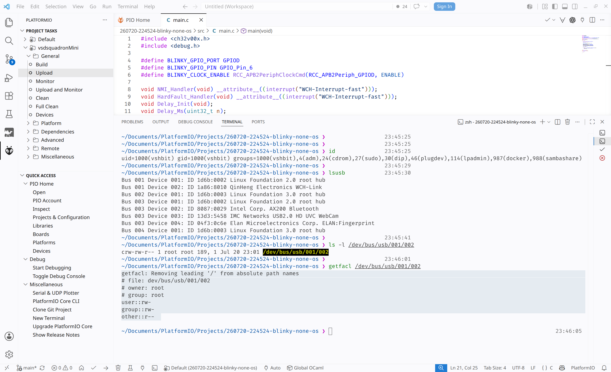
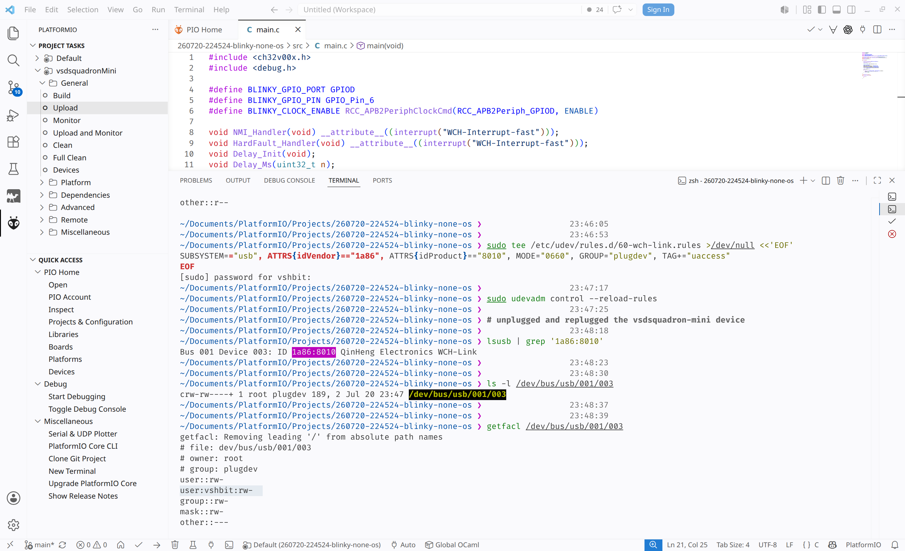
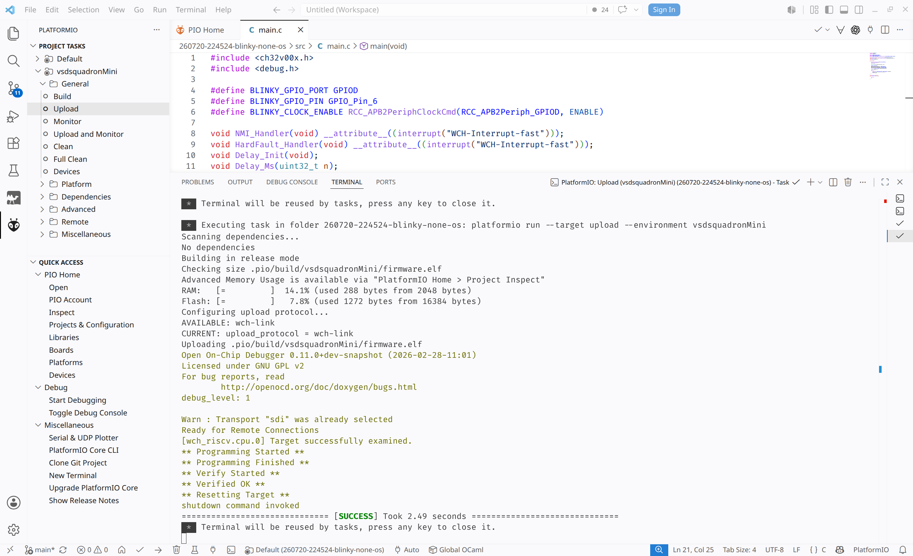
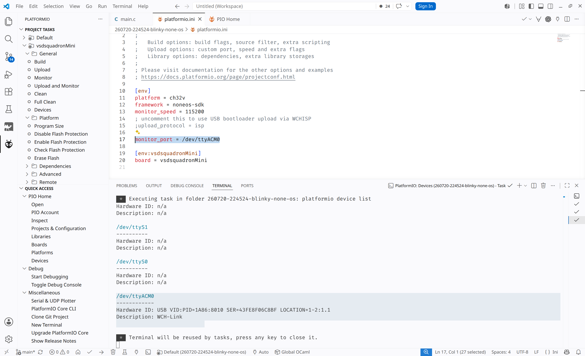
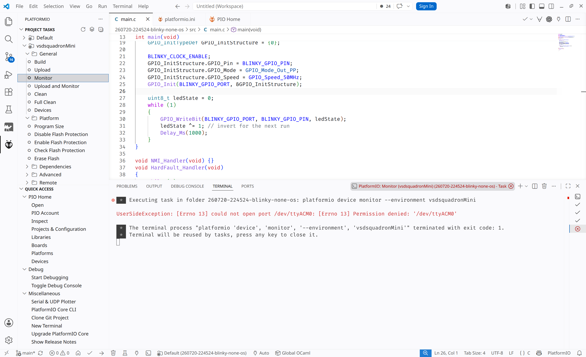
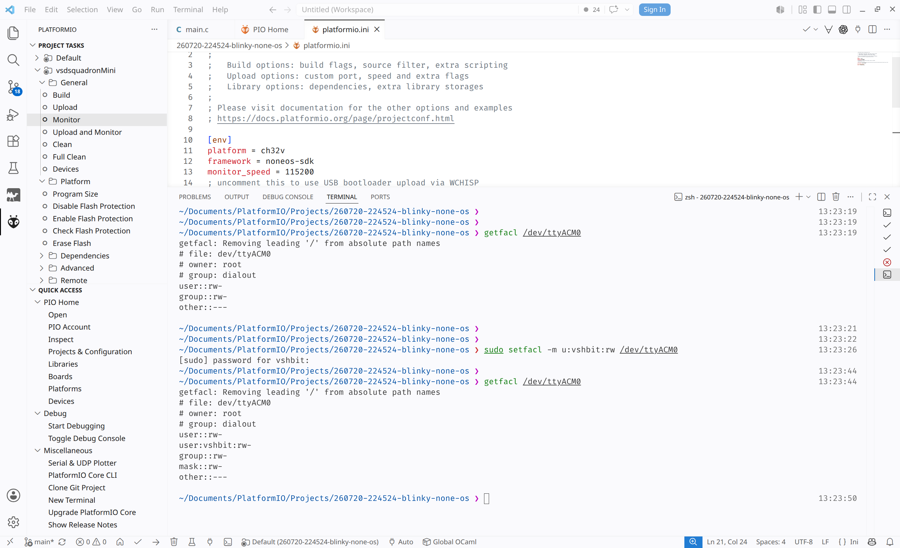

# Linux Debugging and Fix Journey

This document records the build, upload, and serial-monitor problems encountered
on Linux and the fixes that were tested.

## 1. Firmware build error

The first build failed because `NVIC_PriorityGroup_2` was unavailable in the
selected SDK. It was replaced with `NVIC_PriorityGroup_1`, after which the
firmware built successfully.



## 2. Upload permission error

When **Upload** was selected, PlatformIO started OpenOCD internally to access
the WCH-Link programmer. The upload failed with:

```text
libusb_open() failed with LIBUSB_ERROR_ACCESS
Error: open failed
```



`lsusb` confirmed that Linux detected the WCH-Link as USB device `1a86:8010`.



The raw USB device node was owned by `root:root`, and the signed-in user did not
have write access.



A udev rule was installed for the WCH-Link:

```udev
SUBSYSTEM=="usb", ATTRS{idVendor}=="1a86", ATTRS{idProduct}=="8010", MODE="0660", GROUP="plugdev", TAG+="uaccess"
```

The rules were reloaded, and the board was unplugged and reconnected. The USB
node then used group `plugdev` and allowed user read/write access.



The next upload completed programming, verification, and reset successfully.



## 3. Serial-monitor permission error

PlatformIO detected the WCH-Link serial interface at `/dev/ttyACM0`.



Opening **Monitor** initially failed with:

```text
Permission denied: '/dev/ttyACM0'
```



The user was added to `dialout` and logged out and back in, but Monitor still
received the permission error. An explicit ACL was then applied to the current
serial device:

```bash
sudo setfacl -m u:vshbit:rw /dev/ttyACM0
```

The resulting ACL included `user:vshbit:rw-`.



> **Note:** This ACL applies to the current `/dev/ttyACM0` device instance and
> may need to be reapplied after reconnecting the board.

## 4. Final result

After the ACL fix, PlatformIO Monitor opened at 115200 baud. **Upload and
Monitor** showed successful programming, automatic reset, the firmware boot
banner, and consecutive counter lines.


