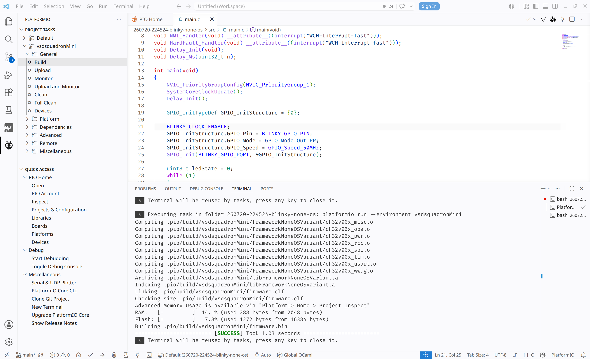
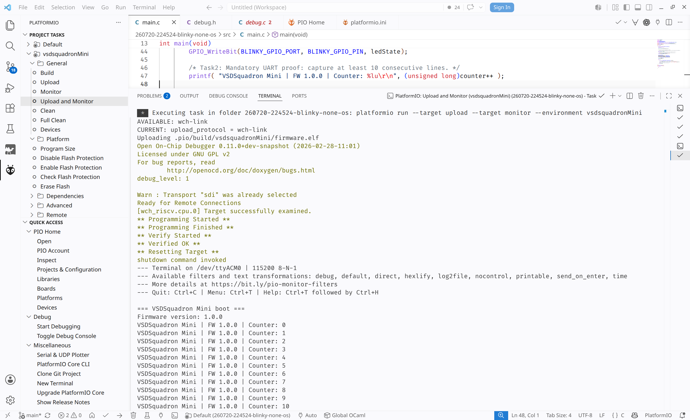
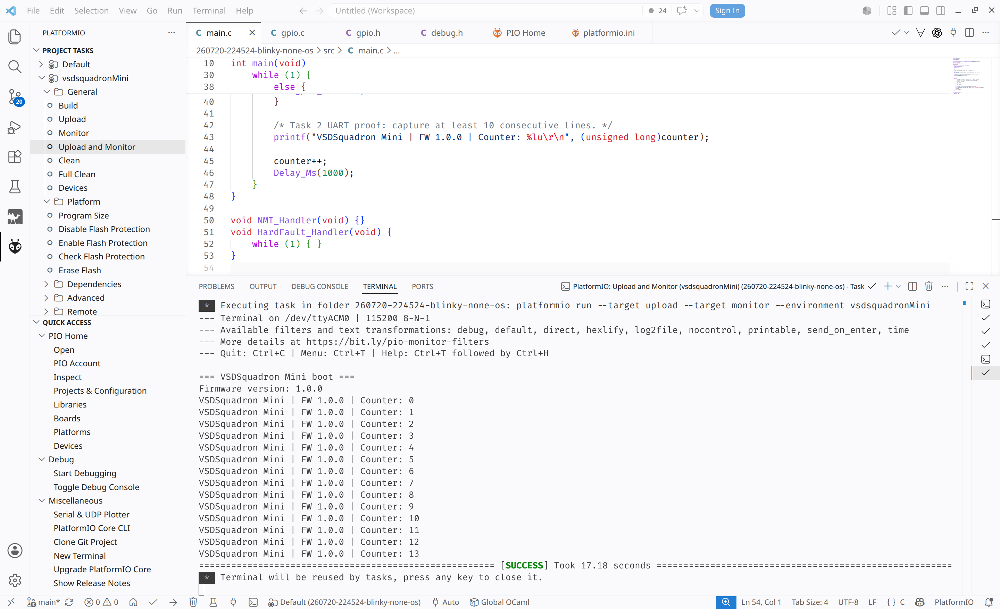
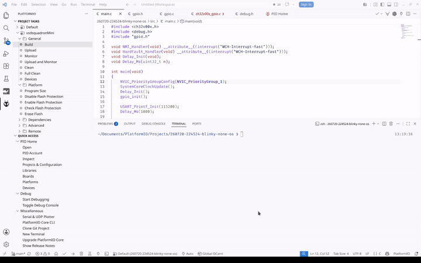
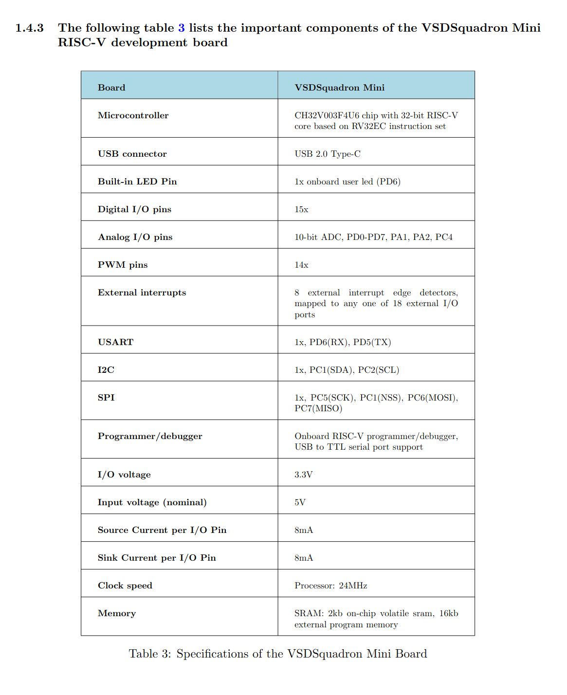
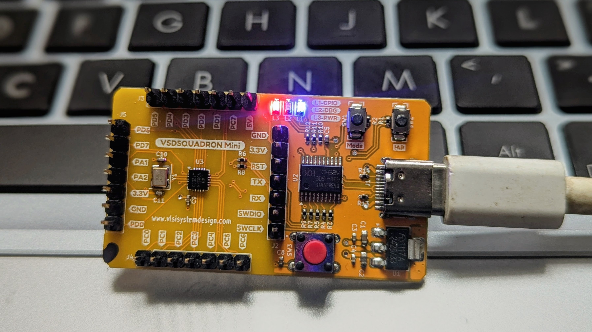

# Task 2 Evidence

## Verification summary

| Requirement | Proof |
|---|---|
| Firmware builds and flashes | PlatformIO build and upload screenshots |
| Board boots after reset | Automatic reset followed by the UART boot banner and counter zero |
| UART output | Board name, firmware version, and more than 10 consecutive counter lines |
| GPIO mapping and operation | `L1-GPIO` mapped to `PD6`; physical photo and blink recording included |
| GPIO API structure | `main.c` calls the API implemented in `gpio.c` and declared in `gpio.h` |

## 1. Build, flash, and reset

PlatformIO built the firmware successfully.

The PlatformIO upload output showed `Programming Finished`, `Verified OK`, and
`Resetting Target`. The UART boot banner and counter starting at zero appeared
after the reset.

## 2. UART evidence

- Baud rate: 115200, 8-N-1
- Startup message: `=== VSDSquadron Mini boot ===`
- Board name: `VSDSquadron Mini`
- Firmware version: `1.0.0`
- Periodic output: increasing counter once per second

The final monitor screenshot shows 14 consecutive counter lines from 0 through
13.

The complete animated recording shows upload, verification, automatic reset,
the startup message, and more than 10 live counter lines.

## 3. GPIO evidence

| Item | Value |
|---|---|
| Physical component | Onboard blue user LED |
| Physical label | `L1-GPIO` |
| Firmware GPIO | `PD6` |
| SDK mapping | `GPIOD`, `GPIO_Pin_6` |
| Configuration | Push-pull output |
| Behavior | Output state changes once per second |

The datasheet identifies the onboard user LED as `PD6`. L1 was selected because
it is visible and requires no external components.

The physical-board photo shows the powered VSDSquadron Mini, USB connection,
and `L1-GPIO` label.

The animated recording shows the blue L1 GPIO LED repeatedly changing between
ON and OFF.

## 4. Verification method

The firmware was built and uploaded through the VS Code PlatformIO extension.
The PlatformIO terminal confirmed programming, verification, and automatic
reset. The UART monitor then displayed the boot banner, version, and increasing
counter. On the physical board, L1 repeatedly changed state. The firmware maps
L1 to PD6 in `gpio.c`, while `main.c` controls it only through `gpio_init()`,
`gpio_set()`, and `gpio_clear()`.
